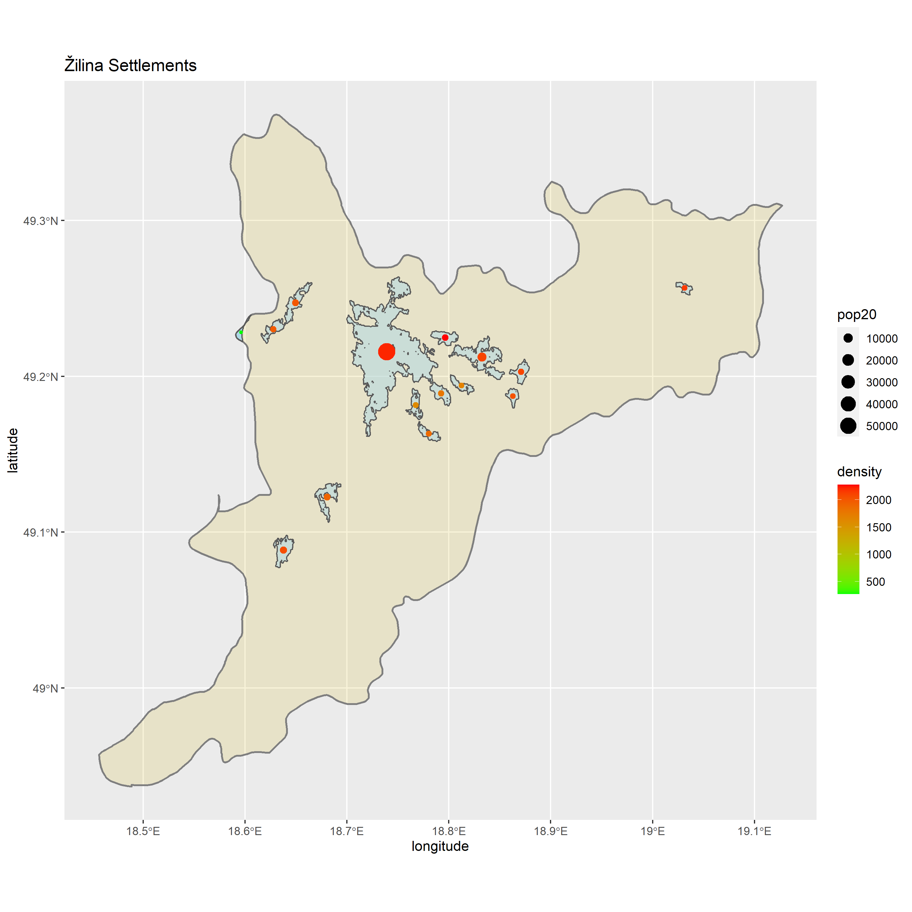
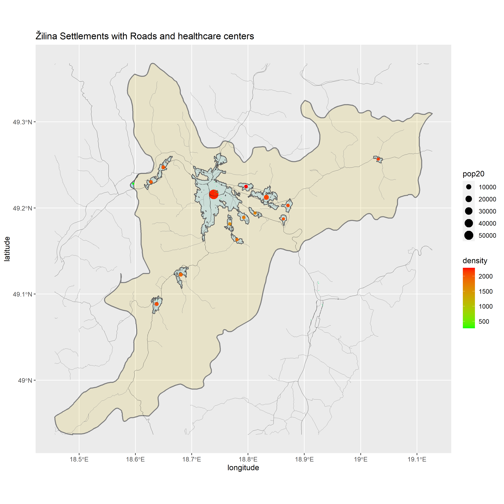
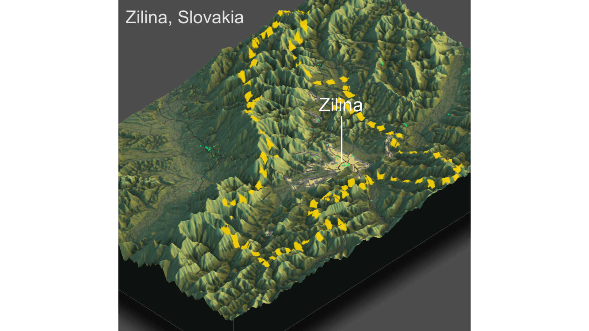

# Population of Žilina

### Deliverable 1

This is a map of the region of Žilina which is in the northwestern part of Slovakia. Within the region there is the city of Žilina, which is the 4th largest city in Slovakia. The city is surrounded by mountains and in a valley which accounts for the lack of a population in large parts of the region.

### Deliverable 2

There are 154655 that live within the region of Zilina in Slovakia. The population is primarily centered around the city of Zilina as it has the highest population and most of the population centers within the region. There is not much urban development in the rest of the region due to thre rugged terrain, but the development that is spread throughout the region is centered on major roadways within the region. There is a decent amount of roads and infrastructure spread throughout the region, but there are few roadways that go into the mountains so it is difficult for large amounts of people to settle. Healthcare facilities are concentrated heavily around the city of Žilina, but according to the data set there are no hospitals, just clinics and other kinds of healthcare facilities. I did some additional research that said there were hospitals in the region so I think that there may have been a mistake in th data. Most of the settlements have an easy access to the major road systems, if not they still have some kind of road access, less have access to healthcare, but there are many facilities in the city of Žilina

### Deliverable 3

Urban areas in this region centered in the valley as the mountains offer to many obstacles for creating a large center of population. Roads tend to move through the valleys cutting over the mountains only when they have to in order to connect with other regions of Slovakia. Healthcare facilities are centered in the city of Zilina since that is where the majority of people live and the mountains would make it inefficient to place healthcare facilities in places it is difficult for people to travel to. No the three dimensional map has not changed any of my previous analysis as everything was centrally located meaning that there must be something that limits expansion in other areas. All this did was offer an explanation of why the population was centered in a certain way. 

