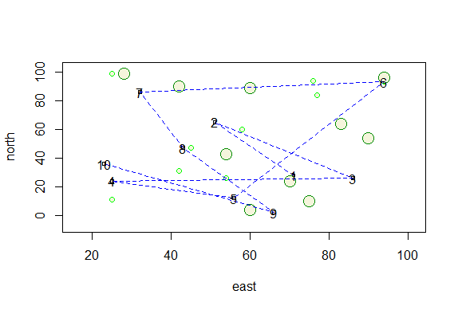
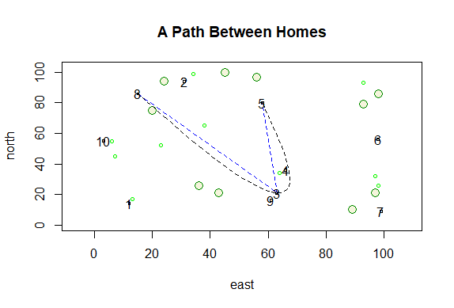
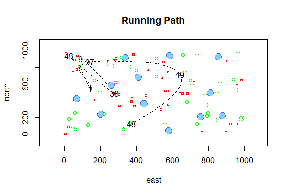

# Complex Graph

In this graph set the x and y values for 1 through 100 and randomly sampled 10 points while calling the x value east and the y value north. Then to plot the points I used symbol() to set the size and the shape. I then set the sample within the symbol() command and created different color and size circles. I then created a data frame called dwelling using a dataframe by using cbind.data.frame(). I then created lines using the lines() and text () command which went between 10 points that from the dwelling dataframe.

I used all of the same arguments as in the 1st plot up to the data frame, but this time I used the locs <- sample() argument to select three random points on the graph and I used the text() to label them. I created straight lines at first between the three points using the lines(), but then I used xspline() to pick out the best path for the graph. I then used the title() to give the graph a title.

I gave x and y values of 1 to 1000 and then I used symbol() with the east and north designated within it and 50 random squares to be made. I then repeated the process for regular sized circles and trees with different colors and sizes, but I did not designate east and north as I had in the 1st part. I then created a data frame using the cbind.data.frame() called dwelling, randomly selected 10 values with the locs <- sample. I then used xspline() to create a line between the 10 points, but I forgot to give it color. I then used text() to label the 10 points which were randomly selected and title() to give my graph a title. 
