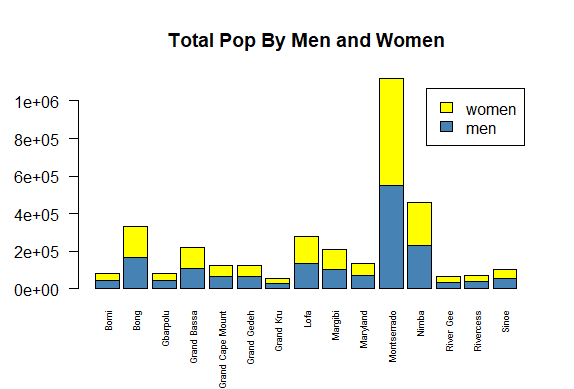

# Bar Graphs

To complete these graphs I started by taking the data from the .csv and the .rdata and sorting it out into columns and rows that made sense. I then did some basic calculations about things like the difference in the total population between source and remote data. I then used the barplot() argument in order to create barplots for all the data created. I think that I may have made a mistake when creating the data for the difference of the percent of women in each since the one value is much higher than the others. 
