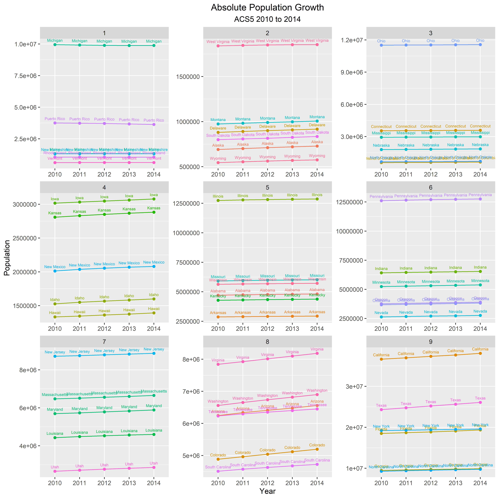

# Project 2

### Part 1

This graph shows the absolute growth in the population of each of the 50 states plus Puerto Rico from 2010 to 2014 and it is split into 9 different quantiles based on population difference. I ran into some trouble making this graph when I was setting up the quantiles as I was using the wrong values so I got the wrong graph several times, but I ended up getting the right graph after I got some help.

This graph shows the average annual growth in the 50 states plus Puerto from 2010 to 2014 and it is split into 9 quantiles. I also had a hard time setting up the quantiles in this graph but I figured it with help.
