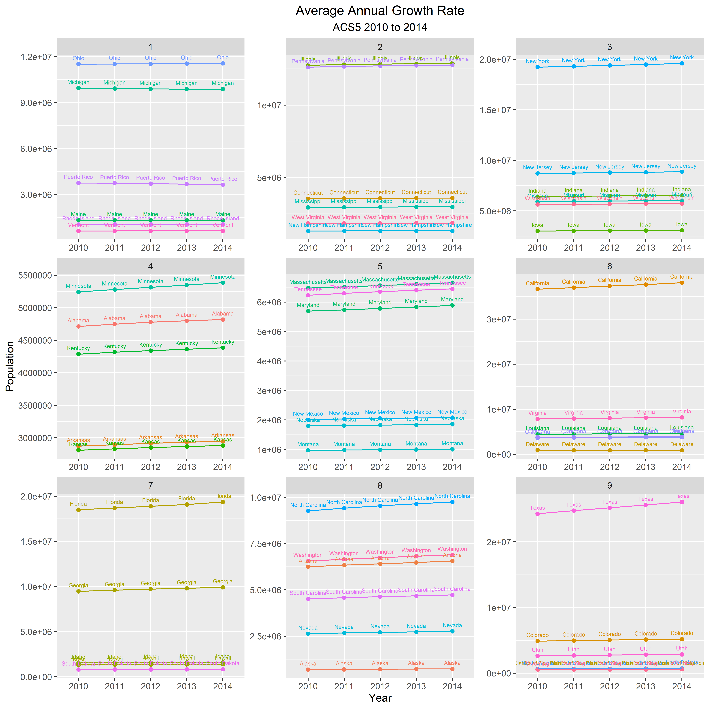
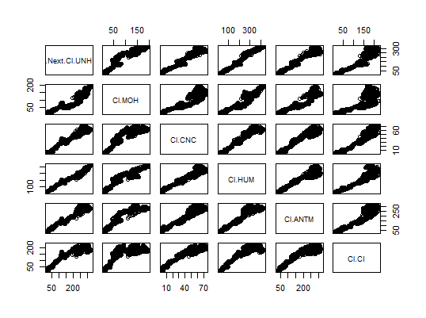

# Project 2

### Part 1

This graph shows the absolute growth in the population of each of the 50 states plus Puerto Rico from 2010 to 2014 and it is split into 9 different quantiles based on population difference. I ran into some trouble making this graph when I was setting up the quantiles as I was using the wrong values so I got the wrong graph several times, but I ended up getting the right graph after I got some help.

This graph shows the average annual growth in the 50 states plus Puerto from 2010 to 2014 and it is split into 9 quantiles. I also had a hard time setting up the quantiles in this graph but I figured it out with help.

### Part 2

This graph shows the performance of the health insurance stocks Anthem(ANTM), United Health Group(UNH), Molina Healthcare(MOH), Centene Corporation(CNC), Humana(HUM), and Cigna(CI). The graph compares the closing of all of the stocks for one day except UNH and the closing price the next day for UNH. When comparing the relationships between the different healthcare providers the relationship generally linear as when the price of one increases the price of the other increases, but there were a few cases of the price starting to curve as the price increased. 

quantmod object:   lm1601822925.15481 	Build date:  2020-10-04 10:48:45 

Model Specified: 
     (Next(Cl(UNH))) ~ (Cl(MOH)) + (Cl(CNC)) + (Cl(HUM)) + (Cl(ANTM)) +   (Cl(CI)) 

Model Target:  .Next.Cl.UNH 		 Product:  UNH 
Model Inputs:  Cl.MOH, Cl.CNC, Cl.HUM, Cl.ANTM, Cl.CI 

Fitted Model: 

	Modelling procedure:  lm 
	Training window:  64  observations from  2020-06-25 to 2020-09-24

Call:
lm(formula = quantmod@model.formula, data = training.data)

Residuals:
   Min     1Q Median     3Q    Max 
-9.701 -3.032 -1.012  3.249 12.204 

Coefficients:
            Estimate Std. Error t value Pr(>|t|)    
(Intercept) 123.7043    27.2486   4.540 2.89e-05 ***
Cl.MOH        0.3361     0.1728   1.945  0.05659 .  
Cl.CNC       -0.4440     0.3561  -1.247  0.21747    
Cl.HUM        0.3311     0.1037   3.192  0.00228 ** 
Cl.ANTM       0.1368     0.1605   0.852  0.39745    
Cl.CI        -0.1142     0.1369  -0.834  0.40767    
---
Signif. codes:  0 ‘***’ 0.001 ‘**’ 0.01 ‘*’ 0.05 ‘.’ 0.1 ‘ ’ 1

Residual standard error: 4.729 on 58 degrees of freedom
Multiple R-squared:  0.7266,	Adjusted R-squared:  0.703 
F-statistic: 30.83 on 5 and 58 DF,  p-value: 3.669e-15

The r-squared value of 0.7266 means that the the next day's closing price of UNH could be explained by the prices of the other stocks by 0.7266 so it is a fairly accurate way to predict the price. 
