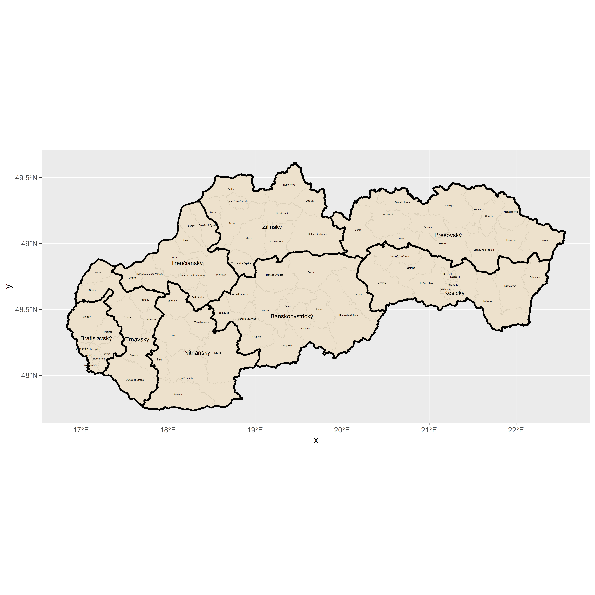
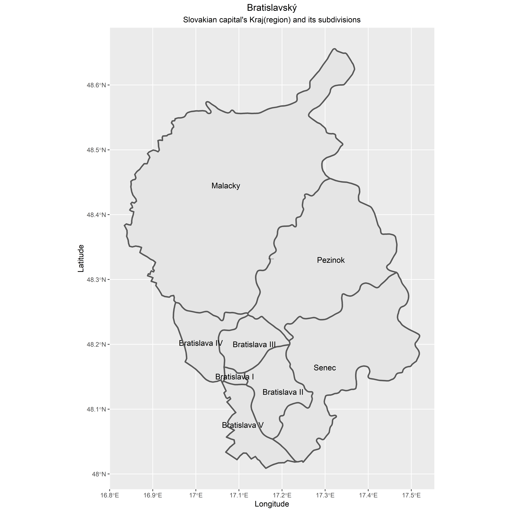

# Project 3

### Deliverable 1

This a map of Slovakia that shows the division of Slovakia into its Kraj, or regions, and the subdivisions within each of the Kraj which are called districts. I used the gadm data in order to create the boundaries.

### Deliverable 2

This is a map of the Kraj of Bratislavský which contains the capital of the nation, Bratislava. 

### Deliverable 3

This map shows the entire country of Slovakia and highlights the Kraj of Bratislavský in green and the Krajs of Košický and Prešovský in blue. There are two smaller maps on the side which zoom into the subdivisions of the map. I choose these subdivisions because it compares the capital and the two most highly populated Krajs within the country.

