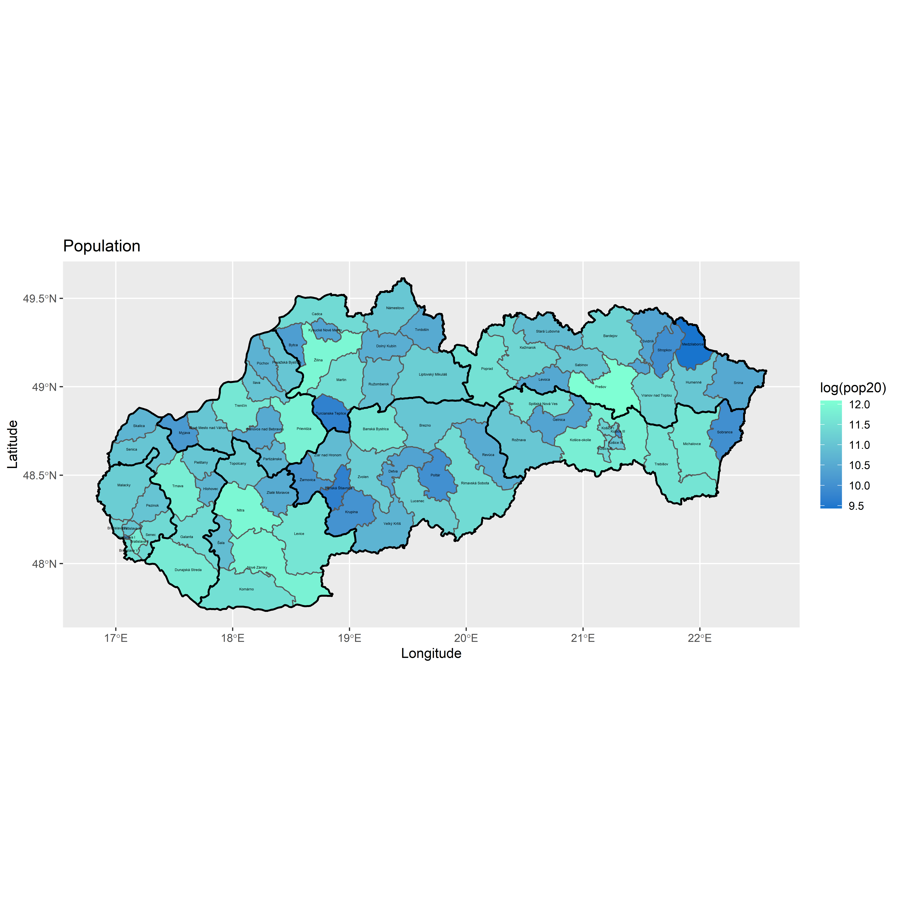

# Project 4

### Deliverable 1

This is a map of the kraj(regions) of Slovakia and the population of each. 

### Deliverable 2

This is a map of the subdivisions within the kraj and the log of their populations.

### Deliverable 3

This map shows the log of the population, just like above, but there is a set color for the midpoint value, so there is three colors factoring into the map.

### Deliverable 4

This is a three dimensional rotation of the log of the population split into the kraj. 

### Stretch Goal 1

### Stretch Goal 2
