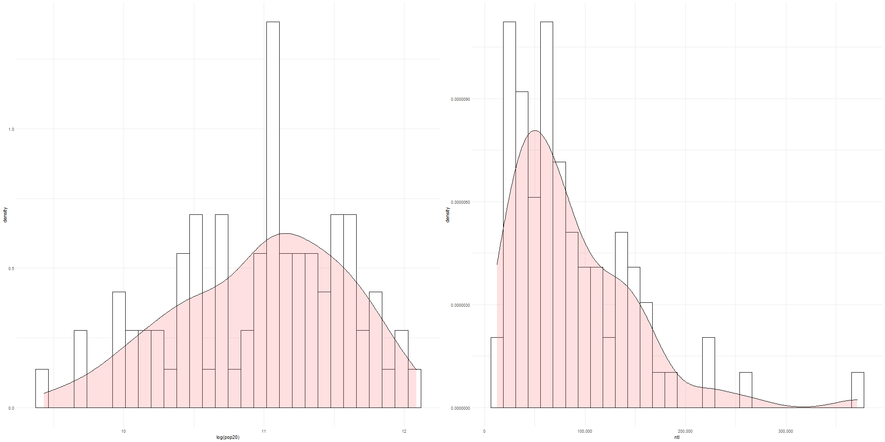

# Project 5

### Deliverable

These histograms show the density of the log of the populations and the night time lights for the subdivisions of the kraj(regions) of Slovakia 

### Stretch Goal

This model shows the relationship between the population and the other variables and it includes the F-significance and adjusted R-squared. 

