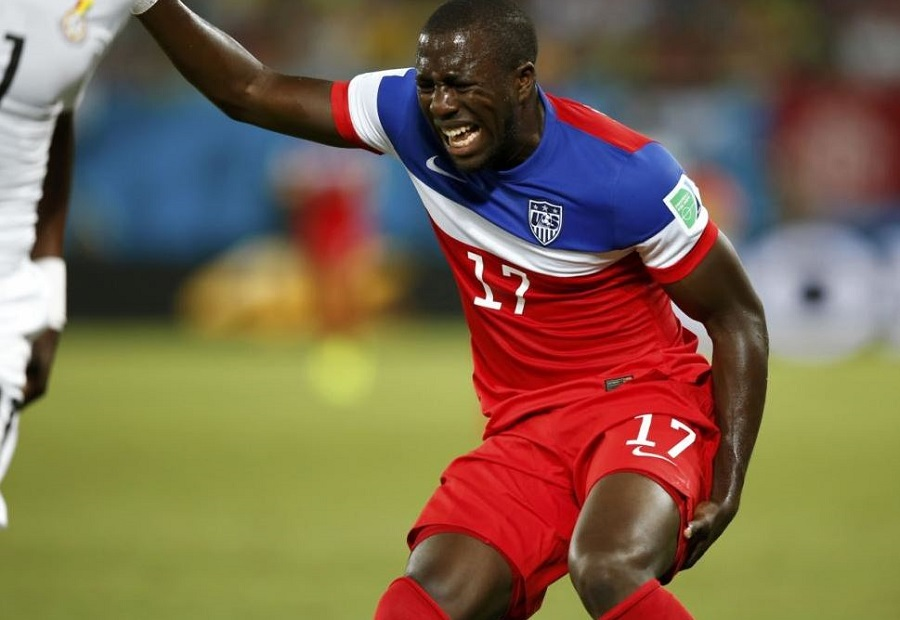

# Reflection: Decision Tree Learning and Forecasting Injuries

Recently data scientists have tried to create a model that could correctly predict when athletes, specifically soccer players, will get injured from non-contact injuries. Many current models for predicting injuries in soccer either lack precision, how accurate a model is when it says a player will get injured, or recall, saying a player will not be at risk of an injury, but they get hurt. In order to try and create a more accurate model Alessio Rossi, et. al., tracked the training sessions of twenty-six Italian professional soccer players over the second half of the season through GPS and attempted to create a model that would accurately predict whether the player would get injured. They tracked fifty-five different variables involving basic data, like weight, data tracked through the GPS, like the number of sprints, a set of calculations based on the GPS data, and recent injury history (Rossi, et al. par. 1-4, 8-11, 14). 

(Talisa, photo)

  The data scientists used a decision tree learning model rather than using forecasting, due to its high false positive rate, or “a ‘black box’… since it does not provide any insights about the reason behind the injuries” (Rossi, et al. par. 3). In order to create the decision tree the data was split into two different groups TTRAIN, 30% of the data, and TTEST, the remaining 70% of the data. They then used Recursive Feature Elimination with Cross Validation in order to narrow down the data that correlated with players getting injuries, rank what the most likely causes were, and to prevent overfitting by testing the model on the TTEST data(3.1 par. 1-3). Once they had completed those steps on TTRAIN they had established their decision tree and set some hyperparameters on which the model will make decisions (Leonel par. 1-2). To check the model even further they split the TTEST data into two parts and oversampled one using ADASYN, but the other side does not use ADASYN. They then check the decision tree from the Test value on the normal set of TTEST data. They then flip the two so that the ADASYN set is now the normal set of data and the normal set now has ADASYN used on it.  They repeat this process ten thousand times in order to develop an accurate model about the accuracy of its predictions. They then do the same process with different types of models in order to see how much more accurate it is. The data models are judged on four metrics precision, recall, F1-score, the “harmonic mean of precision and recall” (Rossi, et al. appendix S8), and AUC(Area Under Curve), the probability a randomly selected positive value will rank higher than a randomly selected negative one(Rossi, et al. par. 20-24). 
 

(Lemieux, photo)

 
  When comparing the models, the one generated by the decision tree was the most precise and had the second highest recall, to the Random Forest classifier, but the F1 score was the highest for the decision tree that the data scientists created. The model had a recall of 0.8 +- 0.07 meaning that it detected on average 80 percent of the injuries meaning very few of the times it said a player could train they were injured. It had a precision of 0.5+-0.11, so 50 percent of the time that the model predicted injury the player was injured. The three primary indicators of the injuries were the amount of time run above 5.5 m/s over time, the distance to the last injury, and the distance covered in the last week. While the results were promising, there is still data that should be factored into the model that has an impact on non-contact injuries. Data from games and other important physical data, like heart rate, were not included, so some factors that likely play a key role in the injury risk of players were not included. Despite these shortcomings of the model the implications of this are important as tracking player movement could allow clubs to be able to predict when a player gets injured, potentially saving clubs millions of dollars on rehab and wages to injured players(Rossi et al. par. 25, 40-45).  
 
 
#### Works Cited

Lemieux, Jeff. “‘Why Are the Players Wearing Sports Bras?!": An Answer to the Burning Question.” New England Revolution, MLS Digital, 13 Sept. 2019, www.revolutionsoccer.net/post/2019/09/12/why-are-players-wearing-sports-bras-answer-burning-question. 

Leonel, Jorge. “Hyperparameters in Machine/Deep Learning.” Medium, Medium, 7 Apr. 2019, medium.com/@jorgesleonel/hyperparameters-in-machine-deep-learning-ca69ad10b981. 

Rossi A, Pappalardo L, Cintia P, Iaia FM, Fernàndez J, Medina D (2018) Effective injury forecasting in soccer with GPS training data and machine learning. PLoS ONE 13(7): e0201264. https://doi.org/10.1371/journal.pone.0201264

Talisa, Maya. “How Soccer Players Can Work to Avoid Hamstring Injuries!” Soccer Cleats 101, Soccer Cleats 101, 6 Feb. 2018, www.soccercleats101.com/2014/11/19/how-soccer-players-can-work-to-avoid-hamstring-injuries/. 

“3.1. Cross-Validation: Evaluating Estimator Performance¶.” Scikit, Scikit-Learn Developers(BSD), 2007, scikit-learn.org/stable/modules/cross_validation.html. 
