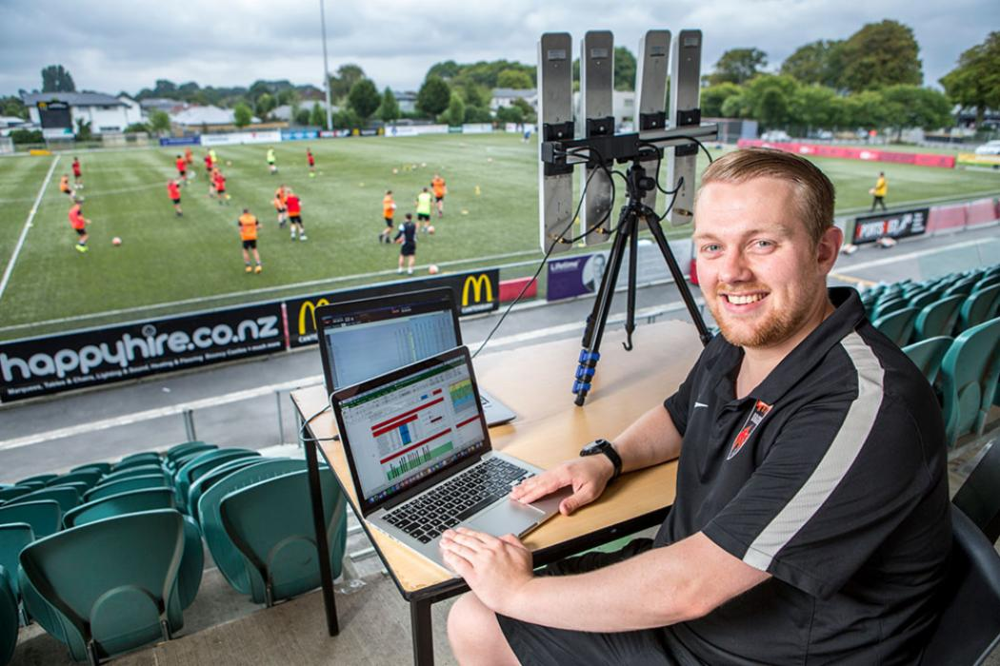
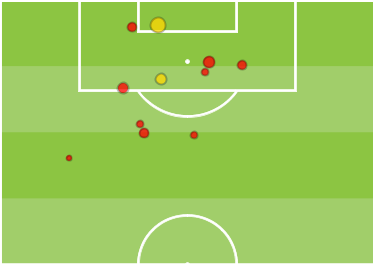
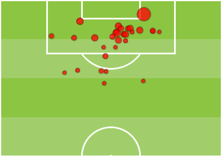

# Uses of Machine Learning in Soccer

The use of machine learning and data science in soccer has been rapidly increasing as more teams, supporters, and oddsmakers are using data science to their benefit. The recent explosion in data science in soccer follows in the footsteps of other sports like baseball, football, and basketball. The use of statistics in soccer has been around since the 1950s when people kept handwritten stats for games, like Charles Reep. Reep’s data and analysis led to the common philosophy, particularly in England, that the most efficient way to score was through long balls, but this analysis was wrong (Aratay par. 4-5, 18-20). Another pioneer of the use of data in soccer was Valeriy Lobanovskyi, a Soviet coach, who used data in order to select players for his team and create an efficient offense (Flint et al. par. 16-17). Until the 2000s data science and machine learning were hardly used in soccer as it was often viewed that they should not involve it in the sport because it would change the game's tradition and in some cases it was seen as useless. The data science revolution in soccer has improved everything from injury prevention to predictions to analyzing opponents (Berrar et al. par. 2, 14-16).

Fig. 1 A data scientist at a training with his setup.

The most important aspect of data science with regards to clubs and national teams is their ability to identify the strengths and weaknesses of players and teams. Today there are many types of statistics and data points that can be found with machine learning systems through companies, like Opta Sports (Berrar et al. par. 14). These companies log player actions from hundreds of games every week creating detailed statistical profiles for all the players in the game. After the game has basic statistics, called events, recorded, like shots, it is often then run through other machine learning systems that can give a more complex understanding about all the actions that a player does(14). Some of these analyses are things like “zones of control”, which show how likely a player is to have or win the ball when it enters a certain space based on where they are standing (12). Another common statistic calculated through machine learning is expected goals which predicts the likelihood that the player scores based on their location, and for some models the players around them(18). By running games through different types of machine learning systems it is possible for clubs to evaluate which players are having an impact within their side and those they should likely sell on as well as those who they should recruit(12, 14-16, 18). For instance, a player could be playing a role in midfield and have a large zone of influence, meaning that they are winning the ball back regularly in that area and maintaining possession in that area. Another benefit is that tracking player data, like movement, it can help teams predict when a player will get injured by pulling a muscle or another non-contact injury (16, 20).

Fig. 2 Expected goals(xG) map in a game between New York Red Bulls(NYRB) on the left and Tijuana on the right. NYRB won the game 2-0, the yellow shots went in, but on xG they lost 0.64-1.85.

Machine learning has begun to improve at predicting varying aspects of soccer that help both the bookies and teams. With regards to the bookies machine learning models have been steadily improving as more data about teams and players make it slightly easier to predict an individual game full of unforseeable events(Berrar et al. par. 2,3). This allows both oddsmakers and bettors to have a greater chance of predicting a game correctly and getting money. Machine learning has also started to help teams improve at their ability to predict opponents’ actions (19). Using machine learning systems to analyze other teams' previous games they are able to predict not only things like team selection, but also reactions that a coach is likely to make, sequences of play, the strengths and weaknesses of opponents (14, 18-19).

#### Works Cited

Arastey, Guillermo Martinez. “History Of Performance Analysis: The Controversial Pioneer Charles Reep.” Sport Performance Analysis, Sport Performance Analysis, 27 Nov. 2019, www.sportperformanceanalysis.com/article/history-of-performance-analysis-the-controversial-pioneer-charles-reep. 

Berrar, D., Lopes, P., Davis, J. et al. Guest editorial: special issue on machine learning for soccer. Mach Learn 108, 1–7 (2019). https://doi.org/10.1007/s10994-018-5763-8

Flint, Andrew, et al. “How Science and Innovation Made Valeriy Lobanovskyi Eastern Europe's Greatest Manager.” These Football Times, These Football Times, 14 Aug. 2018, thesefootballtimes.co/2015/11/26/the-methodical-scientific-genius-of-valeriy-lobanovskyi/. 

Fig. 1 “Performance Analysis.” The University of Canterbury, The University of Canterbury, www.canterbury.ac.nz/study/subjects/performance-analysis/performance-analysis.html. 

Fig. 2 Doyle, Matthew. “Armchair Analyst: What Expected Goals & Game States Say about RBNY's Win.” MLSsoccer.com, MLS Digital, 7 Mar. 2018, www.mlssoccer.com/post/2018/03/07/armchair-analyst-what-expected-goals-game-states-say-about-rbnys-win. 
