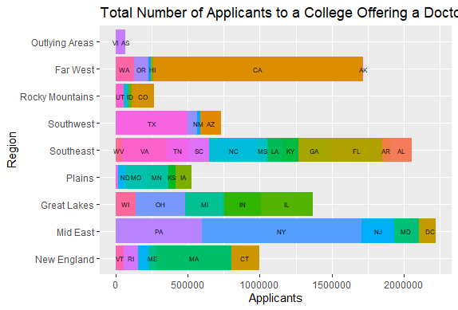

# Project 1

For the graph of the applicants I started by opening the .csv files and creating a data from from the institutional raw data. I then created a data frame of all schools involving 5 set characteristics, a data frame of four year colleges, and a data frame of colleges offering doctoral degrees, in the later two I used subsets. I then created a vector using the names of all of the different regions and applied it to my data frame of all colleges. At this point I believe that I made a mistake as I could not get the names to apply to all of the data frames, ultimately I ended up redoing the argument individually for all of the data frames that I needed it for, but I believe that there was probably an easier way. Then I created data frames like the ones that I made earlier, except that they included the number of students who applied, were admitted, and enrolled at each school. I then loaded ggplot2 and dplyr and set them both as libraries. I then used the ggplot2 and dplyr to create the graph using the 4 year college data frame. For the graph of applicants at schools that offer doctoral programs I copied and pasted the previous ggplot and changed the object name from g to h and changed the variables to what they needed to be.

